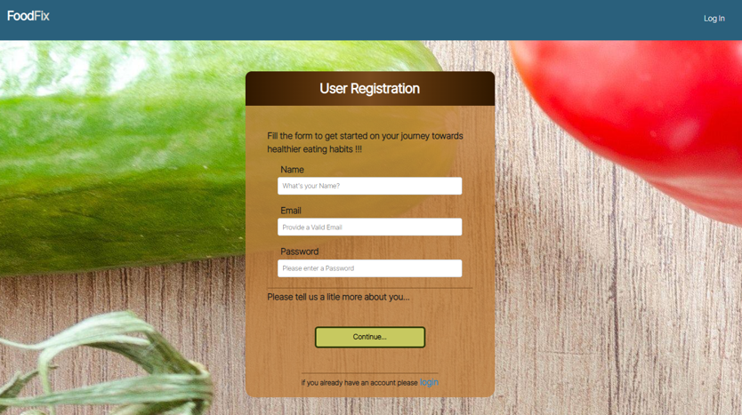
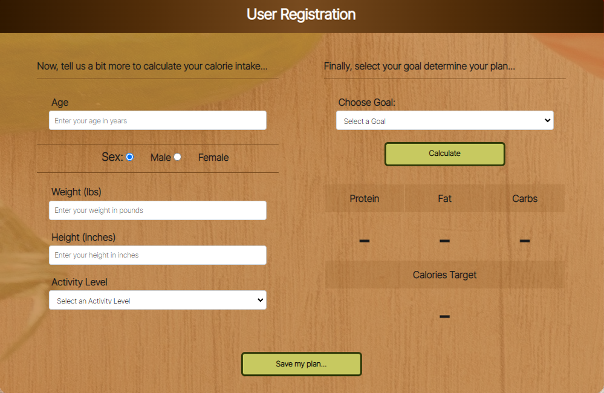
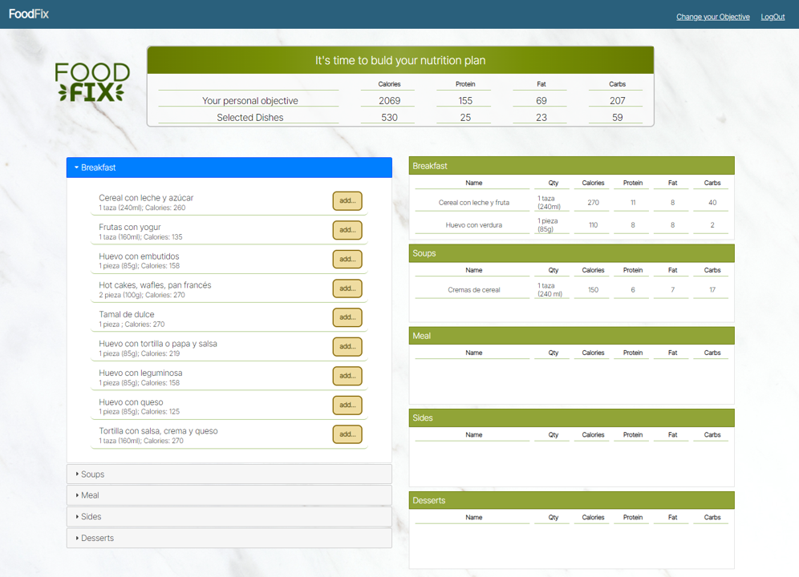

# Calorie Calculator & Meal Planner

  

  ## 🗃️ Description  
  This project will track your calories for the week based on certain parameters like "activity level", "current weight", "height", "sex" etc. Then it will allow you to select from a broad menu of meals within categories like "breakfasts", "meals", "desserts" and it will store this information in our database. 

  

  ## Table of Content
- [Installation](#Installation)
- [Dependencies](#Dependencies)
- [Usage](#Usage)
- [Contributing](#Contributing)
- [License](#license)
- [Test](#Test)
- [Questions](#Questions)

  ## 💽 Installation 
  All packages are inside the package.json file and you must do an "nmp i" but the website will be visible to you on heroku, since it's been deployed there. 

  ## ⚒️ Dependencies 
  It is recommended you use nodemon to keep the server up and running, other dependencies used are visible within the package.json file. 

  ## 🦮 Usage 
  Open the website, register your user and provide your personal information for the calorie counter to provide you with your weekly calorie count, then submit and select your menu.

  Create and account or logIn if you already have an account

  

  
Once you have an account, the app takes you to the calorie calculator. Food Fix needs details such as your activity level and the goal you want to pursue in order to calculate the ideal daily calories intake. Food Fix will save your plan so that you have it as a reference; additionally you are able to change your plan at any time.  

  
Finally, start building your daily menu. In the upper side you will find your ideal calorie intake (Personal Objective) compared to the recipies you select.  

In the left panels are propositions of different recipies classified by type of meal. Simply, click on the add button to start building your ideal menu. On the right side, you will see all selected dishes and Food fix will keep the count of the total calories so that you are sure that your daily menu helps you accomplish your calories objecticves.  

  

  ## 🤝 Contributing 
  Suggestions are more than welcome. 

  ## 💳 Name 
  Alberto Monroy, Eduardo Pachecho, David Torres, David Vallejo, Antonio Garcia-Marquez

  ## 📧 Email 
  firewind3882@gmail.com

  ## 🔐 ## License
      This application is covered by the BSD3 license.

  ## 🧪 Test 
  

  

  ## ❓ Questions

If there's any questions you'd like to shoot my way, Email me at: firewind3882@gmail.com 
  
Find me on GitHub: [darentho](https://github.com/darentho)
  
  